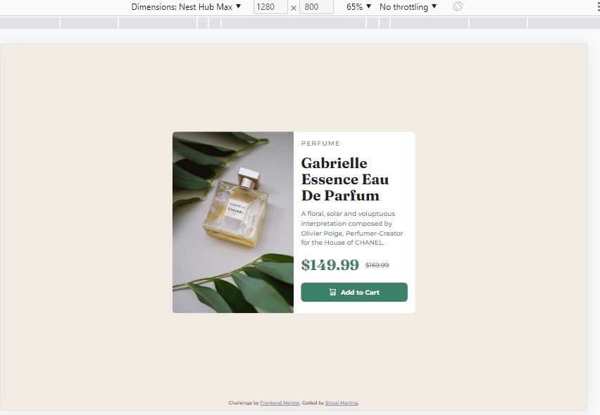
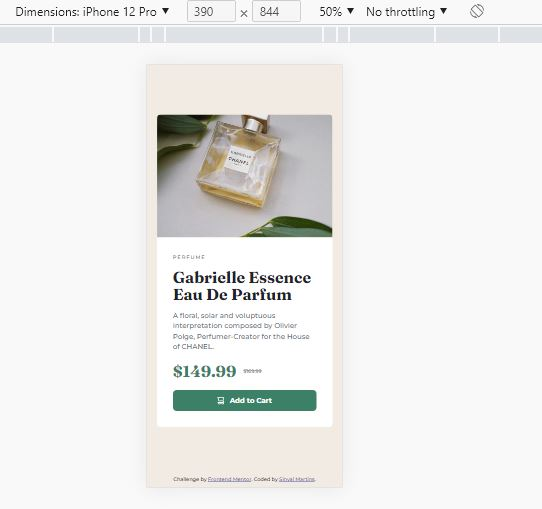

# Frontend Mentor - Product preview card component solution

This is a solution to the [Product preview card component challenge on Frontend Mentor](https://www.frontendmentor.io/challenges/product-preview-card-component-GO7UmttRfa). Frontend Mentor challenges help you improve your coding skills by building realistic projects. 

## Table of contents

- [Frontend Mentor - Product preview card component solution](#frontend-mentor---product-preview-card-component-solution)
  - [Table of contents](#table-of-contents)
  - [Overview](#overview)
    - [The challenge](#the-challenge)
    - [Screenshot](#screenshot)
      - [Desktop](#desktop)
      - [Mobile](#mobile)
    - [Links](#links)
  - [My process](#my-process)
    - [Built with](#built-with)
    - [What I learned](#what-i-learned)
  - [Author](#author)


## Overview

### The challenge

Users should be able to:

- View the optimal layout depending on their device's screen size
- See hover and focus states for interactive elements

### Screenshot

#### Desktop


#### Mobile


### Links

- Solution URL: [GitHub](https://github.com/smartinsdev/card-component-mentor)
- Live Site URL: [Deploy](https://smartinsdev.github.io/card-component-mentor/)

## My process

### Built with

- Semantic HTML5 markup
- CSS custom properties
- Flexbox
- CSS Grid
- Mobile-first workflow

### What I learned

This project I learned about using the _Picture_ tag along with the _Source_ tag to make the image responsive according to screen size. I also used the Mobile-First methodology for the first time

See how it looks below:

```html
<picture>
  <source media="(min-width: 770px)" srcset="./images/image-product-desktop.jpg">
  
</picture>
```
```css
/* Desktop */
@media (min-width: 770px) {
  ...
}
```

## Author

- Frontend Mentor - [@smartinsdev](https://www.frontendmentor.io/profile/smartinsdev)
- Twitter - [@smartinsdev](https://www.twitter.com/@smartinsdev)
